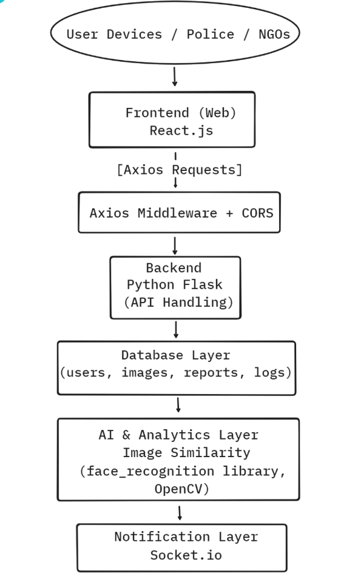
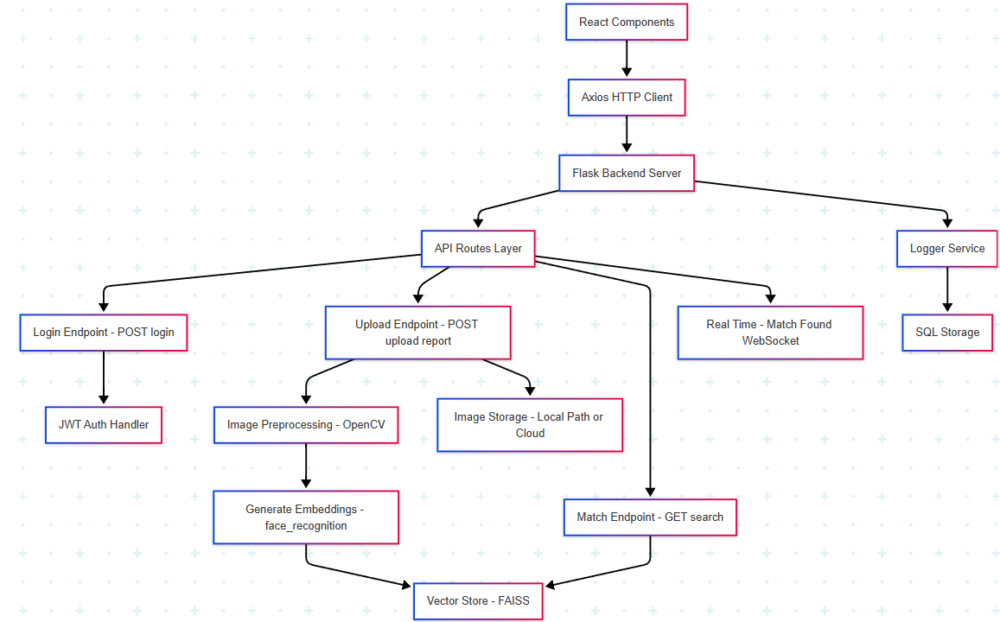

# AnveshanAI
An AI-powered Lost & Found Human Identification System aimed at reuniting missing persons with their families using facial recognition and real-time analytics.

## 🧠 Problem Statement
Millions go missing annually due to displacement, disasters, or trafficking. Manual identification is slow and error-prone. There’s a dire need for a smart, scalable, and AI-driven solution to identify and match missing individuals quickly.

## 🎯 Objective
To automate the process of identifying and matching missing persons using computer vision and facial recognition integrated with a robust cloud-based platform.

## ✨ Key Features
- Image-based person reporting (Lost/Found)
- Face recognition using AI (face_recognition, OpenCV)
- Real-time matching engine (KD-Tree, Euclidean Distance)
- Notification system via Socket.io
- Secure data handling with Flask backend
- Web UI using ReactJS for users, NGOs, and authorities

## 🛠 Tech Stack
- **Frontend**: ReactJS
- **Backend**: Python (Flask)
- **AI Tools**: face_recognition, OpenCV
- **Database**: MongoDB Atlas
- **Tools**: Axios, CORS, Socket.io

## 📝 Workflow


## 🏗 High-Level Design (HLD)


## 🏗 Low-level Design (LLD)


## 🔁 User Flow
1. User uploads photo and details of a lost/found person
2. Image is processed and encoded using AI
3. Encoded data is compared with stored vectors
4. If match is found, notification is sent
5. Authorities/NGOs are alerted through dashboard

## 📸 Screenshots 
- Home Page
- Registration Desk
- Survilliance UI
- Survilliance 
- Missing people list
## 🎥 Demo Video

## ⚙️ Installation
```$ git clone https://github.com/garvitbatra02/Face_recognition_Finding_missing_people ```

- In Node-js server MS
```
$ npm install
$ node index.js
```
- In face_recognition
```
$ pip install virtualenv
$ virtualenv <my_env_name>
$ source <my_env_name>/bin/activate
$ pip install -r requirements.txt
$ streamlit run main.py
```
- In Frontend/frontend MS/msfrontend
```
$ npm install
$ npm start
```
## 🌐 Mordern World Applications
- How many people go missing each year?
Missing people: of the 170,000 people reported missing nearly 98,000 are adults and more than 70,000 are children
Missing incidents: of the 353,000 reported incidents, more than 137,000 incidents are adults and almost 215,000 incidents are children
Looked after children are at high risk of being reported missing. 1 in 10 looked after children are reported missing compared to 1 in 200 children. Looked after children who are reported missing will be reported on average 6 times

- The number of cases shown above is quite large thus resolving each case is practically impossible by human.

- Hence morden technology of face recognition used here can be used to detect missing people and computer vision makes it easy than human effort.

- Here high accuracy of computer vision and machine learning algorithms has more accuracy than any human memory and eyes.

- This system can be easily installed in CCTV cameras and 24/7 surveillance can be carried out

- Further more integerations can be done like multiple models like a person has a particular marks on body due to disease which could also be recognized easiely.

- This model can also be extended or modified to catch criminals .

- It can also be installed in wildlife regions for detecting rare animal species and extinct ones since it is not safe for human to remain everywhere to capture them.

- It can also be used by companies to detect hoarding overlayed in cities to determine density of advertisement.


## 🚀 Scalability

- Docker-based microservices for modular deployment
- Image and metadata storage scale-ready with cloud object stores
- Matching engine optimized for large-scale vector DBs
- Integrating K-dimensional tree for the search instead of the already used linear search to reduce the time complexity from
O(n) to O(log n)

## 🔮 Future Scope

- Age progression prediction for long-missing individuals
- Cross-platform mobile app integration
- Police database & NGO sync using APIs
- Cloud deployment with CI/CD, monitoring

